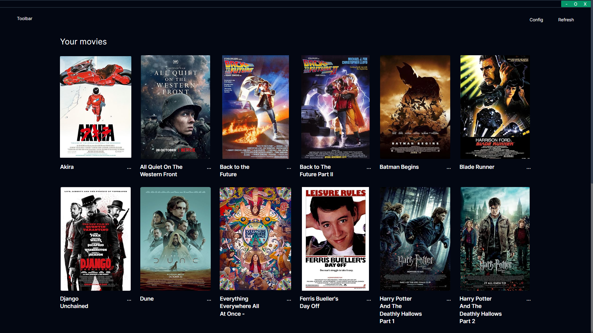

# Movie Organizer


MovieOrganizer is a cross-platform desktop application built with Tauri, Rust, React, and TypeScript for managing movies.

### What you need
- OMDB api key

### Features
✅ Auto fetch poster/metadata using OMDB API
✅ Metadata cache
✅ Clean folder/file name
✅ TOML-based configuration

❌ Play movie within the app
❌ Right click open location with file manager

### Development steps
First install the dependencies
```
{pnpm, yarn, npm} install
```

then run
```
{pnpm, yarn} tauri dev or npm run tauri dev
```

## Troubleshoot
⚠️ Poster doesn't show up? You may need to manually rename the folder.
